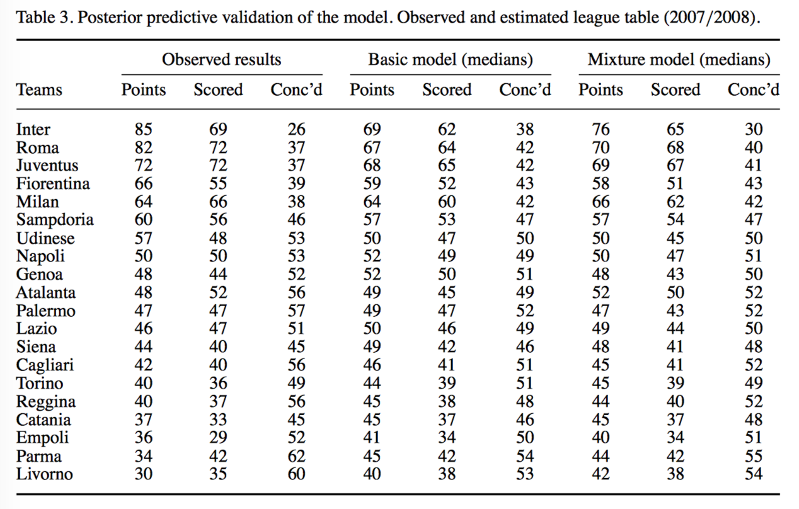

Bayesian hierarchical model for the prediction of football results
========================================================
author: AAA,BBB,CC AND DD
date: 2018-05-27
autosize: true

background
========================================================
- why do we predict?
- paper:
- a Bayesian hierarchical model for the number of goals scored by the two teams in each match.
- why hierarchical?
    - "Hierarchical models are widely used in many different fields as they are natural way of taking into account relations between variables, by assuming a common distribution for a set of relevant parameters thought to underlie the outcomes of interest."

base model - parameters and variables
========================================================
- $T$, $G$
- For the $g$-th game, $y_{gj}\mid\theta_{gj}\sim Poisson(\theta_{gy})$, conditional on parameters $\mathbf{\theta}=(\theta_{g1},\theta_{g2})$ (scoring intensity in the $g$-th game)
- $\log\theta_{g1}=home+att_{h(g)}+def_{a(g)}$
- $\log\theta_{g2}=att_{a(g)+def_{a(g)}}$
    - $home$
    - $att$, $def$

base model - priors
========================================================
- $home$: fixed effect, uninformative:
    - $home\sim N(0,0.0001)$
- $att, def$: team-specific
    - $att_t\sim N(\mu_{att},\tau_{att}), def_t\sim N(\mu_{def},\tau_{def})$
    - zero-sum contraints: $\sum^T_{t=1}att_t=0, \sum^T_{t=1}def_t=0$
    - baseline/corner constraint: $att_1=0, def_1=0$
- hyperpriors of $att, def$:
    - uninformative
    - $\mu_{att}\sim N(0,0.0001), \mu_{def}\sim N(0,0.0001)$
    - $\tau_{att}\sim Gamma(0.1,0.1), \tau_{def}\sim Gamma(0.1,0.1)$
    
base model - priors
========================================================

- unobservable hyper-parameters $\mathbf{\eta}=(\mu_{att},\mu_{def},\tau_{att},\tau_{def})$

base model - objectives
========================================================
1. **estimate**
the value of the main effects that we used to explain the scoring rates (by entering the evidence provided by the observed results, $\mathbf{y}$ vector and updating the prior distributions by means of the Baye's thm using a MCMC)

2. **prediction**, use the results in the implied posterior dist for the vector $\mathbf{\theta}$ to predict a future occurence of a similar (exchangeable) game. After convergence, produce a vector $\mathbf{y}^{pred}$ of 1000 replications from the posterior predictive dis of $\mathbf{y}$ that we used for direct model checking.

why not base model
========================================================
- **overshrinkage**: some of extreme occurrences tend to be pulled towards the grand mean of the observations.
- it could be possible for our case since the performance of different teams in a league in a season can diverge, some are really good, some are really bad.
- previous model the hyper-parameters assume all attack/defense intensity are drawn by a common process, which is not sufficient to capture the different skill levels of each team, therefore, shrinkage, penalizing extremely good teams and overestimating the bad teams

hierarchical model
========================================================
- stratify the teams into 3 levels: **top, mid** and **bottom**
- model the $att$ and $def$ parameters using a non central $t$ distribution on $\nu=4$ degrees of freedom, instead 2 from normal
- the observable variables, the prior specificaition for $\theta_{gj}$, the hyper-parameter home is unchanged, other hypers are modeled as
    - each team $t$ has two latent (unobservable) variables $grp^{att}(t), grp^{def}(t)$ taking on the value of $1,2,3$ representing **bottom, mid, top** level. These are given suitable categorical dist each depending on a vector of prior probability $\mathbf{\pi}^{att}=(\pi^{att}_{1t}, \pi^{att}_{2t}, \pi^{att}_{3t})$ and $\mathbf{\pi}^{def}=(\pi^{def}_{1t}, \pi^{def}_{2t}, \pi^{def}_{3t})$
    -  $\mathbf{\pi}\sim Dirichlet(1,1,1)$
    
hierarchical model
========================================================
- $att_t\sim nct(\mu^{att}_{grp(t)},\tau^{att}_{grp(t)},\nu)$
- $def_t\sim nct(\mu^{def}_{grp(t)},\tau^{def}_{grp(t)},\nu)$
- $grp^{att}(t), grp^{def}(t) \implies$
    - $att_t=\sum^3_{k=1}\pi_{kt}^{att}\times nct(\mu^{att}_{grp(t)},\tau^{att}_{grp(t)},\nu)$
    - $def_t=\sum^3_{k=1}\pi_{kt}^{def}\times nct(\mu^{def}_{grp(t)},\tau^{def}_{grp(t)},\nu)$
- $\mu_1^{att}\sim truncN(0,0.001,-3,0), \mu_1^{def}\sim truncN(0,0.001,0,3)$
- $\mu_3^{att}\sim truncN(0,0.001,0,3), \mu_3^{def}\sim truncN(0,0.001,-3,0)$
- $\mu_2^{att}\sim N(0,\tau_2^{att}), \mu_2^{def}\sim N(0,\tau_2^{def})$
- $\tau_k^{att}\sim Gamma(0.01, 0.01), \tau^{def}_k\sim Gamma(0.01, 0.01)$

hierarchical model - updated results (07-08)
========================================================
- context changed: winning points, league expansion
- bigger gap between two extremes

discussion
========================================================
- limitation: predictions are obtailned in one batch — using the observed results to estimate the parameters.

- improvement: hyper as "time" specifc, to include more variables like injuries, suspensions, winning streak etc.

replication
========================================================
- source: web-mined data from open-soccer
- tool: `pymc`
- some modifications in our replication:

application
========================================================
- on premier league 2015-2016 when the leichester city won the title what a miracle!

references
========================================================
- Bayesian hierarchical model for the prediction of football results, Gianluca Baio and Marta Blangiardo
- Hierarchical Bayesian Modeling of the English Premier League, Milad Kharratzadeh, see also https://github.com/milkha/EPL_KDD
- A Bayesian inference approach for determining player abilities in soccer, Gavin A. Whitaker, Ricardo Silva, Daniel Edwards
- Modeling Match Result in Soccer using a Hierarchical Bayesian Poisson Model, Rasmus Baath
